# BeerBaseball stats app
iOS app developed in Swift using SwiftUI framework.

* App to save statistics when you play BeerBaseball
* Tool to help you track the stats of your games

[BeerBaseball Rules](https://en.wikipedia.org/wiki/Baseball_(drinking_game))

## Features
- Add new users to have a list of all the players
- Create two teams before starting the Game
- When you start a game there will be a coin flip to decide who starts
- Add a play each time something happens in the Game
- You can view the score to keep track of the Game
- List of rules of the game
- View historical stats by category for each player

## Validations
- Can't start the game until each team has at least one player
- When you select the attacking team you will only be able to select players from that team as batters
- The game tracks which bases have players so when you make a HIT or a Home Run the corresponding number of runs will be added to the score
- After 3 strikes you will get an out

## Available plays
- HIT (Select base)
- Home Run
- Strike (Can select Foul)
- Out (Select catcher)
- Steal base

## Stats Available
- Batting %
  - Number of Hits
  - Number of Home Runs
  - Number of Strikes
  - Number of Fouls
  - Number of Outs

- % of Bases
  - Number of Hits to First Base
  - Number of Hits to Second Base
  - Number of Hits to Third Base

- % of Outs
  - Number of Outs by Catch
  - Number of Outs by Strikes
  - Number of Outs when Stealing Bases

- % of Base Steals
  - Number of Successful Steals
  - Number of Unsuccessful Steals

- % of Bases Defend
  - Number of Successful Bases Defended
  - Number of Unsuccessful Bases Defended

- Number of outs made

## TO DO
- [ ] Visualize what bases are occupied by players
- [ ] Add description to the rules
- [ ] Be able to see the number of outs for each team

## Screenshots

### Create Users
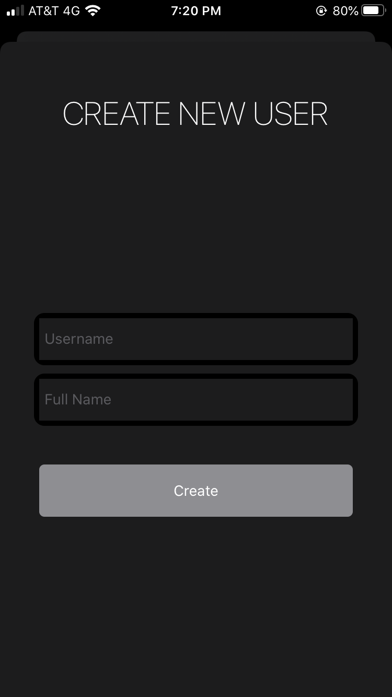

### View Users
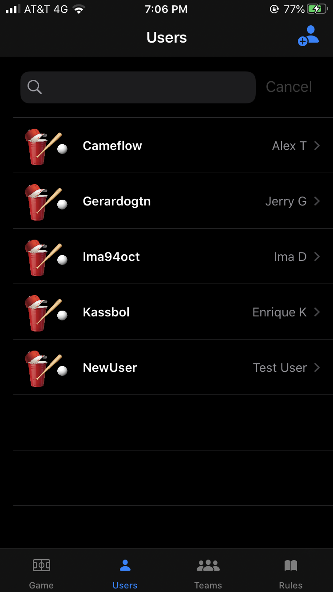

### View User
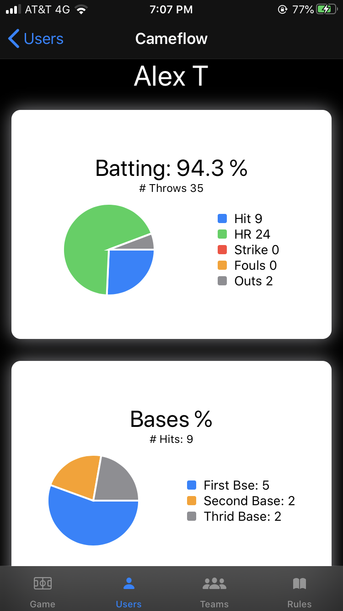

### Create Teams
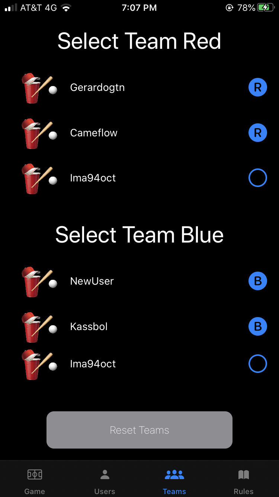

### Start Game
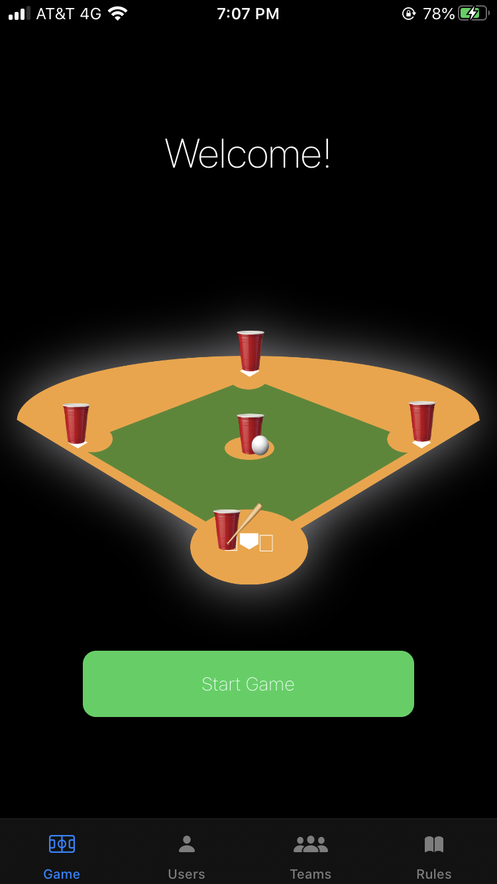

### Coin Flip
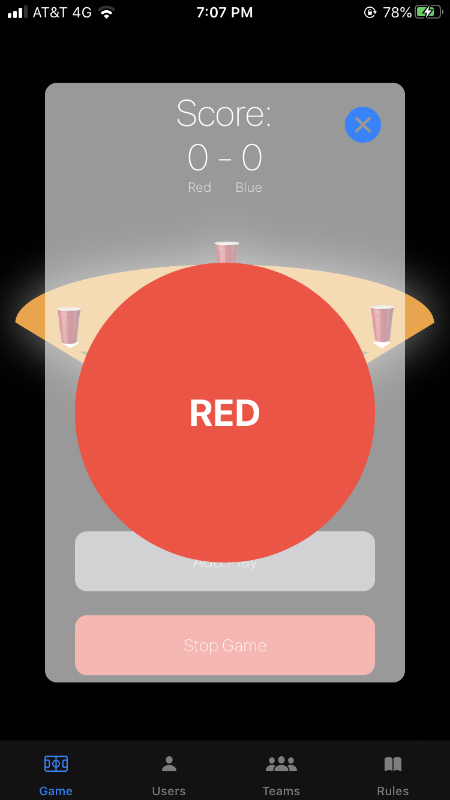

### Score
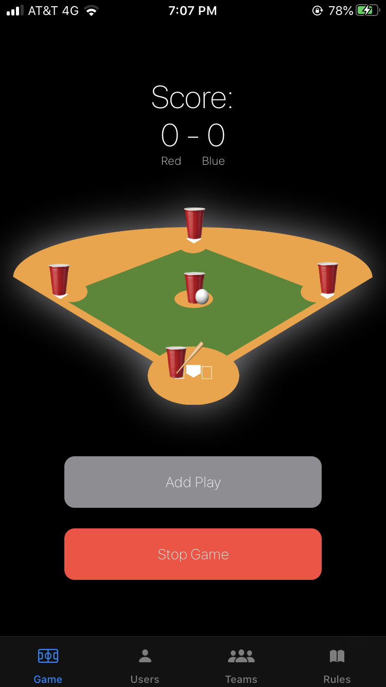

### Add Plays
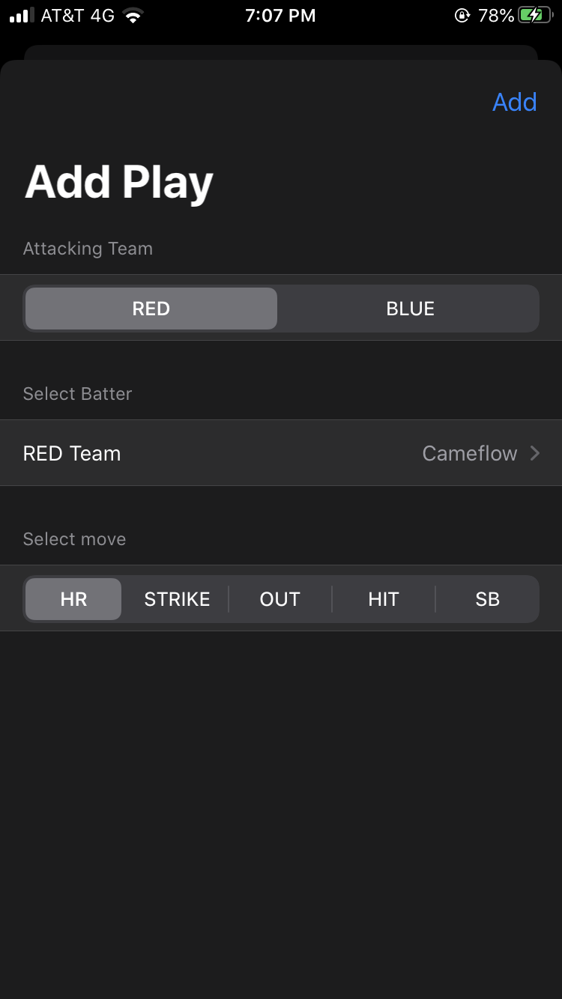
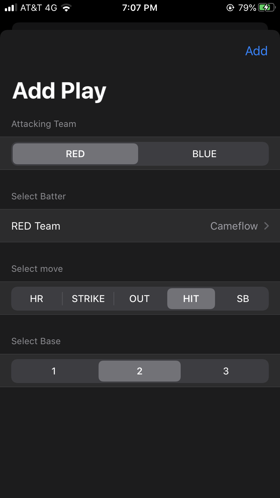
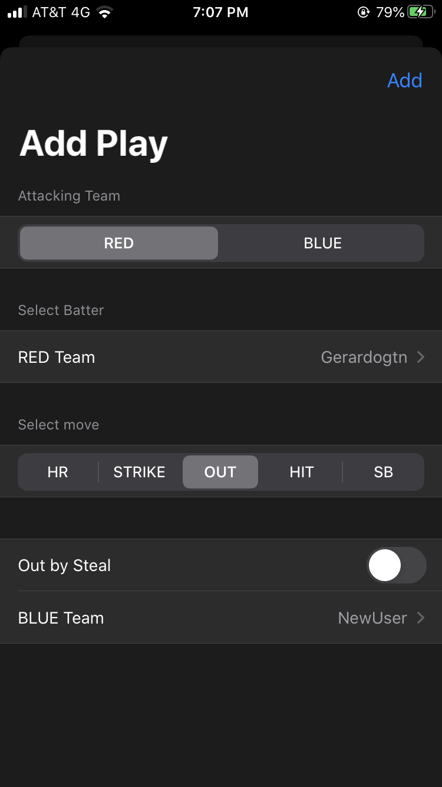

### Rules
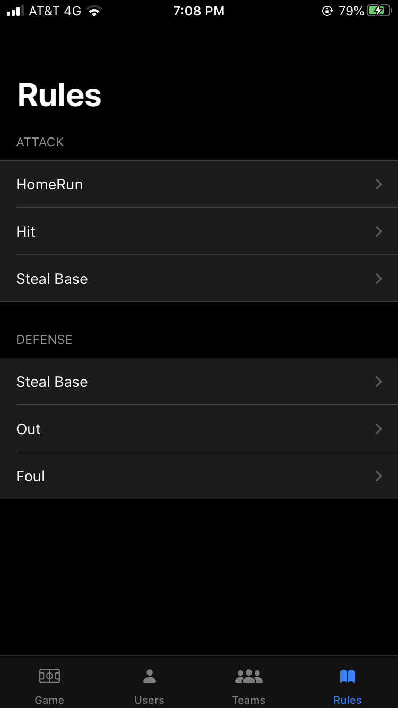
